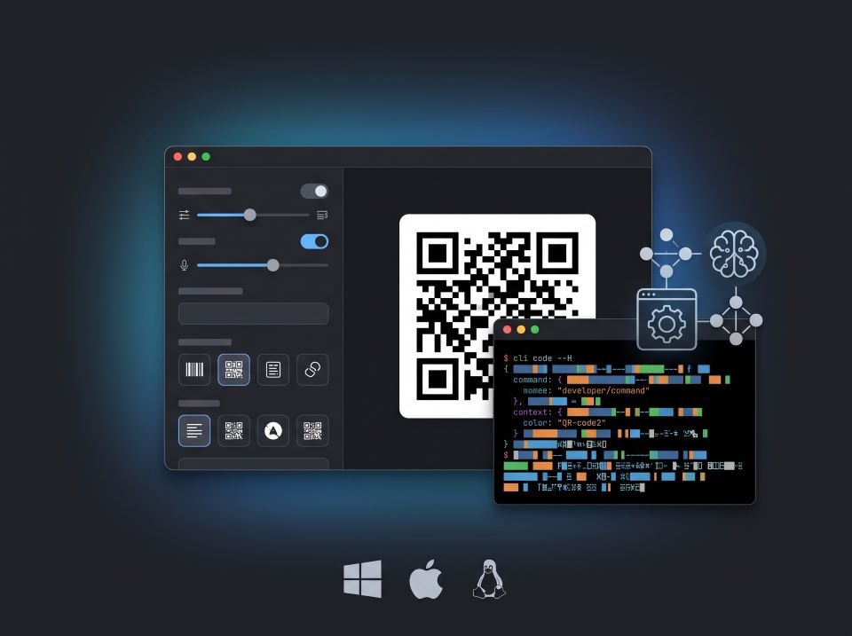
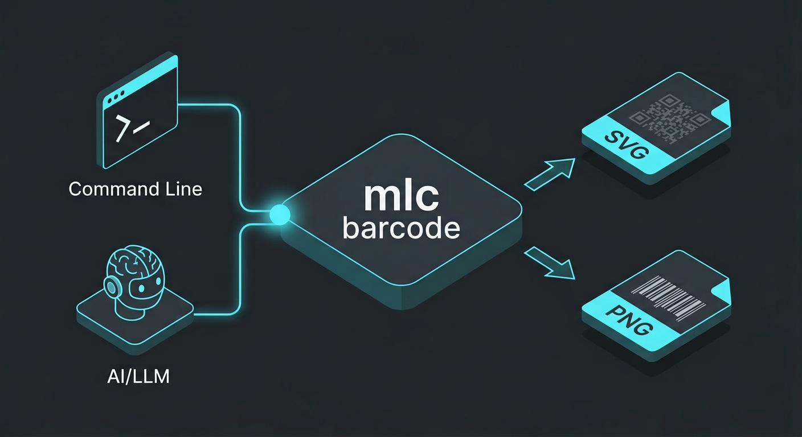
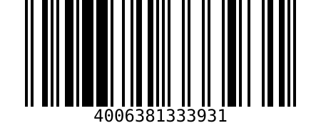
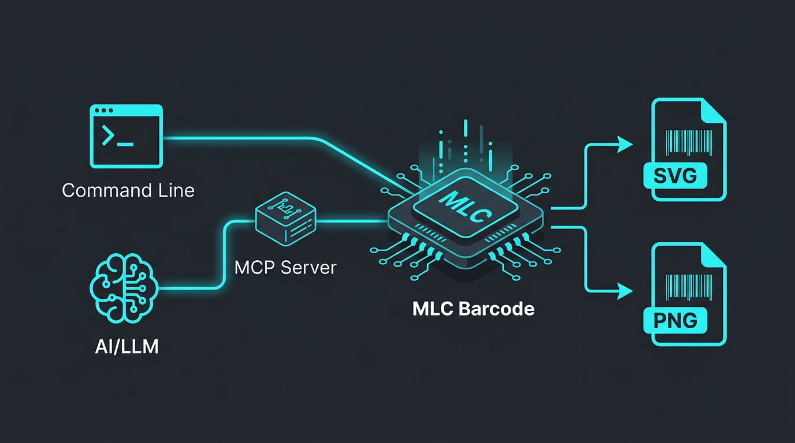

# MLC Barcode — Desktop GUI, CLI & MCP Server

> **[mlcgo.eu](https://mlcgo.eu)** — Werkzeuge, Bibliotheken und Handbücher · [Produktseite](https://mlcgo.eu/products/mlc-barcode/)


Ein Werkzeug zur Generierung von Barcodes und QR-Codes — als Desktop-GUI, als Kommandozeilen-Tool (CLI) und als Model Context Protocol (MCP) Server.





## Version
Aktuelle Version: **1.4.0**

## Funktionen
- Unterstützt mehrere Barcode-Typen: QR, DataMatrix, Code128, Code39, EAN-13, EAN-8, UPC-A, ITF.
- Ausgabeformate: SVG (vektorbasiert) und PNG.
- Anpassbare Größe und optionale Textanzeige für generierte SVG-Bilder.
- MCP-Server Integration für LLMs (bietet das Tool `generate_barcode` an).
- **Optionale Artifact-Anbindung**: Generierte Barcodes können direkt an den `mlcartifact` Dienst gesendet werden.
- Saubere Projektstruktur nach Go Best Practices.

## Installation

Stellen Sie sicher, dass Go installiert ist.

```bash
git clone <repository-url>
cd mlc_barcode
task build
```

Die Binärdateien befinden sich in `bin/`:
- `barcode`: CLI Werkzeug
- `mcp-barcode-server`: MCP Server

## Benutzung als CLI

```bash
# Version anzeigen
./bin/barcode -version

# Einen QR-Code als SVG generieren
./bin/barcode -type qr -data "Hallo Welt" -out test.svg

# Optional: Als Artifact speichern
./bin/barcode -type qr -data "Hallo Welt" -out test.png -artifact -artifact-addr localhost:9590
```

### Parameter

- `-type`: Barcode-Typ (Standard: `qr`).
- `-data`: Der zu kodierende Inhalt (erforderlich, sofern keine strukturierten Flags genutzt werden).
- `-out`: Ausgabedatei mit Endung `.svg` oder `.png` (Standard: `barcode.svg`).
- `-width`: Breite in Pixeln.
- `-height`: Höhe in Pixeln.
- `-text`: Text unter dem Barcode anzeigen (Standard: `false`).
- `-fg` / `-bg`: Vorder- und Hintergrundfarben (z. B. `red`, `#ff0000`, `transparent`).
- `-version`: Version anzeigen und beenden.

#### Strukturierte QR-Flags (Automatische Formatierung)
- **WLAN**: `-wifi-ssid`, `-wifi-pass`, `-wifi-enc` (WPA/WEP/nopass). [Dokumentation](docs/qr-formats/wifi.de.md)
- **vCard**: `-vcard-first`, `-vcard-last`, `-vcard-email`, `-vcard-tel`. [Dokumentation](docs/qr-formats/vcard.de.md)
- **Termin**: `-event-summary`, `-event-start` (YYYYMMDDTHHMMSS), `-event-end`, `-event-tz`. [Dokumentation](docs/qr-formats/event.de.md)
- **GiroCode (EPC)**: `-epc-name`, `-epc-iban`, `-epc-bic`, `-epc-amount`, `-epc-ref`. [Dokumentation](docs/qr-formats/epc.de.md)
- **Krypto**: `-crypto-coin`, `-crypto-addr`, `-crypto-amount`, `-crypto-msg`. [Dokumentation](docs/qr-formats/crypto.de.md)
- **Geo**: `-geo-lat`, `-geo-lon`, `-geo-query`. [Dokumentation](docs/qr-formats/geo.de.md)
- **Telefon**: `-tel`. [Dokumentation](docs/qr-formats/tel.de.md)
- **SMS**: `-sms`, `-sms-text`. [Dokumentation](docs/qr-formats/sms.de.md)
- **E-Mail**: `-mail-to`, `-mail-subject`, `-mail-body`. [Dokumentation](docs/qr-formats/email.de.md)

## Beispielausgabe
 

Detaillierte Beispiele finden Sie im **[Showcase](showcase/SHOWCASE.de.md)**.

## Benutzung als MCP Server



Der Server unterstützt Stdio (Standard) und SSE.

### Integration in Claude Desktop (Stdio)
Ergänzen Sie Ihre `claude_desktop_config.json`:

```json
{
  "mcpServers": {
    "mlc-barcode": {
      "command": "/pfad/zu/mlc_barcode/bin/mcp-barcode-server",
      "args": ["-artifact-addr", "localhost:9590"]
    }
  }
}
```

Das MCP-Tool `generate_barcode` hat zusätzliche Parameter:
- `save_artifact` (boolean): Wenn true, wird der Barcode via mlc_artifact gespeichert (benötigit mlc artifact mcp server) gespeichert.
- `filename` (string): Optionaler Dateiname im Artifact-Speicher.

### SSE Modus
```bash
./bin/mcp-barcode-server -addr :8080 -artifact-addr localhost:9590
```

## Entwicklung

- `task build`: Kompiliert alles.
- `task dev:server`: Startet den MCP Server über stdio.
- `task clean`: Aufräumen.
- `task test`: Unit-Tests ausführen.

## Referenz

Das **[MCP-Handbuch](https://mlcgo.eu/books/mcp-handbuch/)** erklärt das Model Context Protocol von Grund auf —
Tools, Resources, Prompts, Transporte, Sicherheit und das Artifact-Pattern.
Auf Deutsch und Englisch.

---

## Lizenz

Copyright (c) 2026 Michael Lechner.
Lizenziert unter der MIT-Lizenz.

---
**Hinweis:** Aktuell sind keine weiteren Erweiterungen oder größeren Änderungen geplant, da sich die Werkzeuge im Alltag – insbesondere auch in Verbindung mit Large Language Models (LLMs) – bestens bewährt haben.
