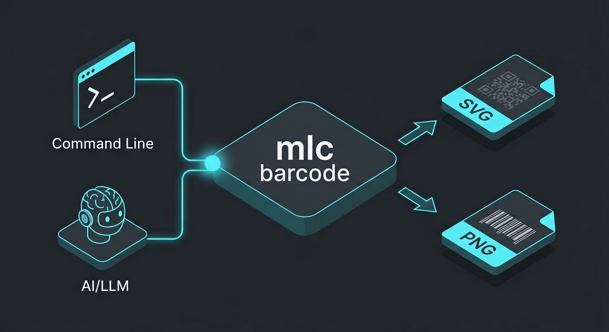
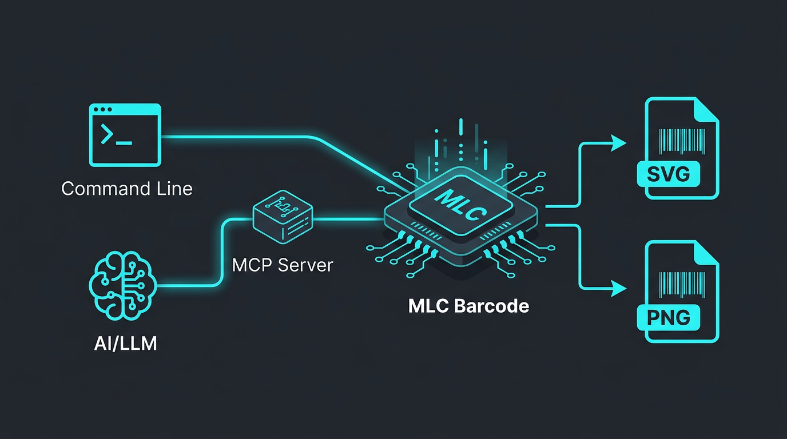

# MLC Barcode CLI & MCP Server

A tool for generating barcodes, usable as both a Command Line Interface (CLI) and a Model Context Protocol (MCP) server.



## Version
Current Version: **1.1.0**

## Features

- Supports multiple barcode types: QR, DataMatrix, Code128, Code39, EAN-13, EAN-8, UPC-A, ITF.
- Output formats: SVG (vector-based) and PNG.
- Adjustable size and optional text display for generated SVG images.
- MCP Server integration for LLMs (provides the `generate_barcode` tool).
- **Optional Artifact connection**: Generated barcodes can be sent directly to the `mlcartifact` service.

## Installation

Make sure you have Go installed.

```bash
git clone <repository-url>
cd mlc_barcode
make build
```

The binaries are located in `bin/`:

- `barcode`: CLI tool
- `mcp-barcode-server`: MCP server

## CLI Usage

```bash
# Show version
./bin/barcode -version

# Generate a QR code as SVG
./bin/barcode -type qr -data "Hello World" -out test.svg

# Optional: Save to artifact service
./bin/barcode -type qr -data "Hello World" -out test.png -artifact -artifact-addr localhost:9590
```

### Parameters

- `-type`: Barcode type (default: `qr`).
- `-data`: Data to encode (required if no structured flags are used).
- `-out`: Output file with `.svg` or `.png` extension (default: `barcode.svg`).
- `-width`: Width in pixels.
- `-height`: Height in pixels.
- `-text`: Show text below barcode (default: `false`).
- `-fg` / `-bg`: Foreground and Background colors (e.g., `red`, `#ff0000`, `transparent`).
- `-version`: Show version and exit.

#### Structured QR Flags (Automatic formatting)
- **WIFI**: `-wifi-ssid`, `-wifi-pass`, `-wifi-enc` (WPA/WEP/nopass).
- **vCard**: `-vcard-first`, `-vcard-last`, `-vcard-email`, `-vcard-tel`.
- **Event**: `-event-summary`, `-event-start` (YYYYMMDDTHHMMSS), `-event-end`, `-event-tz`.

## Example output
 

Detailed examples can be found in the **[Showcase](showcase/SHOWCASE.md)**.

## MCP Server Usage



The server supports Stdio (default) and SSE.

### Claude Desktop Integration (Stdio)

Add this to your `claude_desktop_config.json`:

```json
{
  "mcpServers": {
    "mlc-barcode": {
      "command": "/path/to/mlc_barcode/bin/mcp-barcode-server",
      "args": ["-artifact-addr", "localhost:9590"]
    }
  }
}
```

The MCP tool `generate_barcode` has additional parameters:

- `save_artifact` (boolean): If true, saves the barcode to the artifact service.
- `filename` (string): Optional filename in the artifact store.

### SSE Mode

```bash
./bin/mcp-barcode-server -addr :8080 -artifact-addr localhost:9590
```

## Development

- `make build`: Compiles everything.
- `make run-server`: Starts the MCP server via stdio.
- `make clean`: Clean up.
- `make test`: Run unit tests.

## License

Copyright (c) 2026 Michael Lechner.
Licensed under the MIT License.
