# MLC Barcode Showcase

Dieses Dokument zeigt Beispiele für die verschiedenen Barcode-Typen und Ausgabeformate, die mit dem `mlc_barcode` CLI-Tool generiert werden können.

## 1. QR Code

### SVG Format (Standard)
```bash
./bin/barcode -type qr -data "https://github.com/mlcmcp/mlc_barcode" -out showcase/assets/qr.svg
```
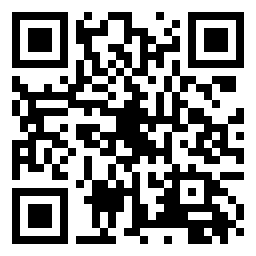

### PNG Format (Standard)
```bash
./bin/barcode -type qr -data "Gemini CLI" -out showcase/assets/qr.png
```
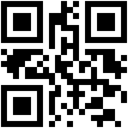

### Transparenter Hintergrund (SVG)
```bash
./bin/barcode -type qr -data "Transparent QR" -out showcase/assets/qr_transparent.svg -bg transparent
```


### Rot auf Transparent (PNG)
```bash
./bin/barcode -type qr -data "Red on Transparent" -out showcase/assets/qr_red_transparent.png -fg red -bg transparent
```
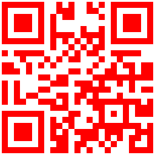

---

## 2. Code 128

### SVG mit Text
```bash
./bin/barcode -type code128 -data "MLC-BARCODE-123" -out showcase/assets/code128.svg -text
```
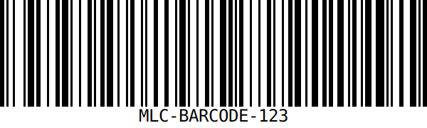

### Farben (Blau auf Gelb)
```bash
./bin/barcode -type code128 -data "Blue on Yellow" -out showcase/assets/code128_colors.svg -fg blue -bg "#ffff00" -text
```
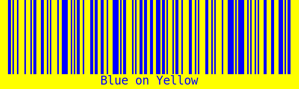

---

## 3. DataMatrix (SVG)
```bash
./bin/barcode -type datamatrix -data "DataMatrix Example" -out showcase/assets/datamatrix.svg
```
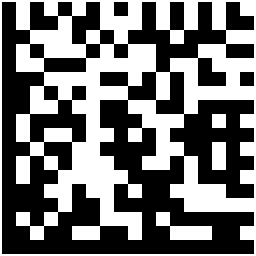

---

## 4. EAN-13 (SVG mit Text)
```bash
./bin/barcode -type ean13 -data "4006381333931" -out showcase/assets/ean13.svg -text
```
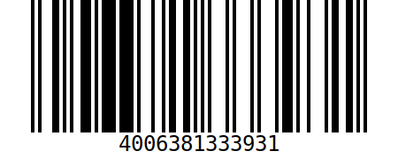

---

## 5. Code 39 (PNG mit Text)
```bash
./bin/barcode -type code39 -data "CODE39" -out showcase/assets/code39.png -text
```
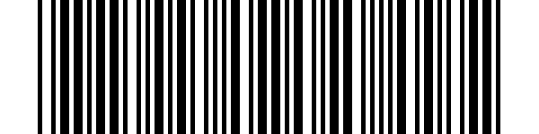

---

## 6. Spezialisierte QR-Codes

Diese Beispiele nutzen die neuen Formatierungs-Vorlagen für gängige Aufgaben wie WLAN-Zugang, Kontaktaustausch und Termin-Einladungen.

### WLAN-Zugang
```bash
# Daten-Format: WIFI:T:WPA;S:ShowcaseNet;P:password123;;
./bin/barcode -type qr -data "WIFI:T:WPA;S:ShowcaseNet;P:password123;;" -out showcase/assets/qr_wifi.png
```
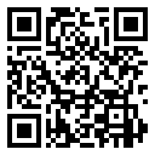

### vCard 3.0 (Kontakt)
```bash
# Daten-Format: BEGIN:VCARD...
./bin/barcode -type qr -data "BEGIN:VCARD..." -out showcase/assets/qr_vcard.png
```
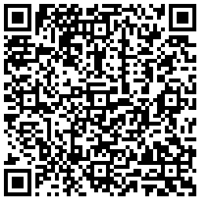

### iCalendar (Termin)
```bash
# Daten-Format: BEGIN:VCALENDAR...
./bin/barcode -type qr -data "BEGIN:VCALENDAR..." -out showcase/assets/qr_event.png
```
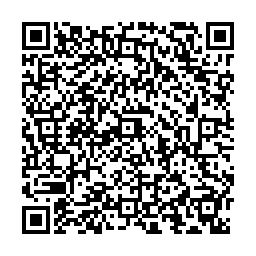

---

## Zusammenfassung der Parameter

| Parameter | Beschreibung |
|-----------|--------------|
| `-type`   | Barcode-Typ (qr, datamatrix, code128, code39, ean13, etc.) |
| `-data`   | Die zu kodierenden Daten |
| `-out`    | Dateiname (Endung bestimmt Format: .svg oder .png) |
| `-text`   | Text unter dem Barcode anzeigen (falls unterstützt) |
| `-fg`     | Vordergrundfarbe (z.B. black, red, #0000ff) |
| `-bg`     | Hintergrundfarbe (z.B. white, transparent, #ffff00) |
| `-width`  | Optionale Breite in Pixeln |
| `-height` | Optionale Höhe in Pixeln |
